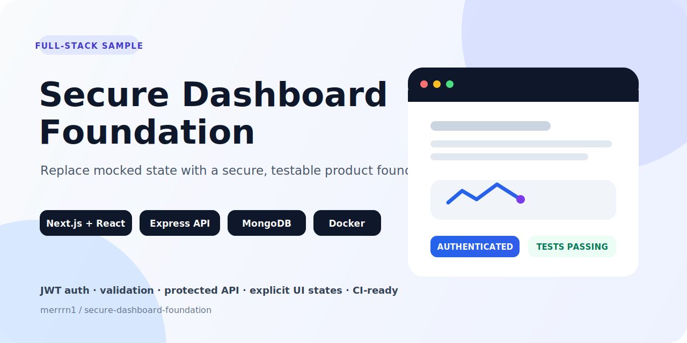
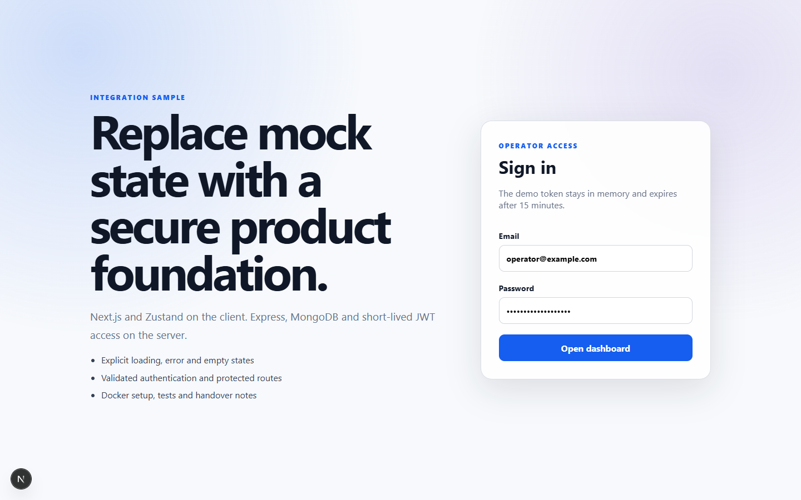

# Secure Dashboard Foundation

[](https://github.com/merrrn1/secure-dashboard-foundation/actions/workflows/ci.yml)
[](https://www.typescriptlang.org/)
[](https://nextjs.org/)
[](docker-compose.yml)
[](LICENSE)

A compact, production-minded example of replacing a mocked dashboard with real authentication and API data.

The repository demonstrates the integration layer that often sits between an already-built interface and a real product: short-lived JWT access, protected Express routes, MongoDB persistence, typed Next.js API calls, Zustand state, explicit loading/error/empty states, Docker setup, and API tests.



## Architecture

```text
Next.js App Router + Zustand
          │
          │ JSON / Bearer JWT
          ▼
Express 5 API ── validation, Helmet, CORS, rate limiting
          │
          ▼
      MongoDB 8
```

## What is implemented

- Real email/password authentication with bcrypt password hashes.
- Fifteen-minute JWT access tokens with issuer, audience and algorithm verification.
- Protected dashboard endpoint scoped to the authenticated user.
- Request validation with stable machine-readable error responses.
- Security baseline: small JSON body limit, Helmet headers, explicit CORS origin and login rate limiting.
- MongoDB repository separated behind a `DataStore` interface, so tests use fast in-memory fixtures.
- Zustand store that replaces mocked state with real API responses.
- Deliberate loading, error, retry and empty states.
- Docker Compose environment and repeatable test, typecheck and build commands.

## Run locally

```bash
cp .env.example .env
npm install
docker compose up -d mongo
npm run seed --workspace @secure-dashboard/api
```

Run the services in two terminals:

```bash
npm run dev:api
npm run dev:web
```

Open `http://localhost:3000` and use:

- Email: `operator@example.com`
- Password: `local-demo-password`

The password is only a local seed default. Set `SEED_PASSWORD` before running the seed command to override it.

## Verify

```bash
npm test
npm run typecheck
npm run build
```

## Decisions and production follow-ups

This sample intentionally keeps access tokens in memory rather than local storage. A production continuation would add an HTTP-only, `Secure`, `SameSite` refresh cookie; rotation and revocation; CSRF handling appropriate to the deployment; structured audit events; secrets management; and contract tests against the real backend.

The code is generic and contains no client source, credentials or private business logic.
